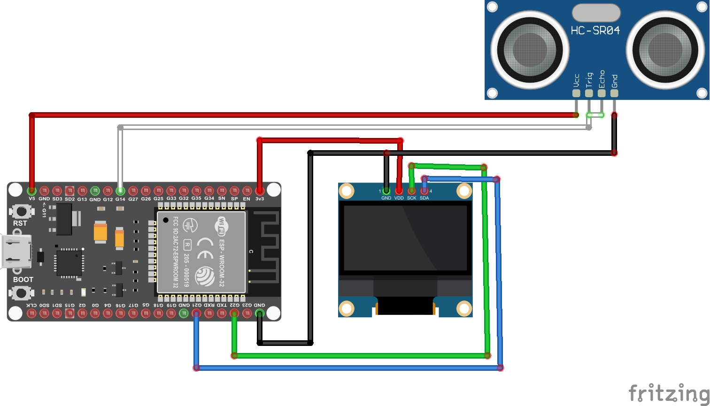
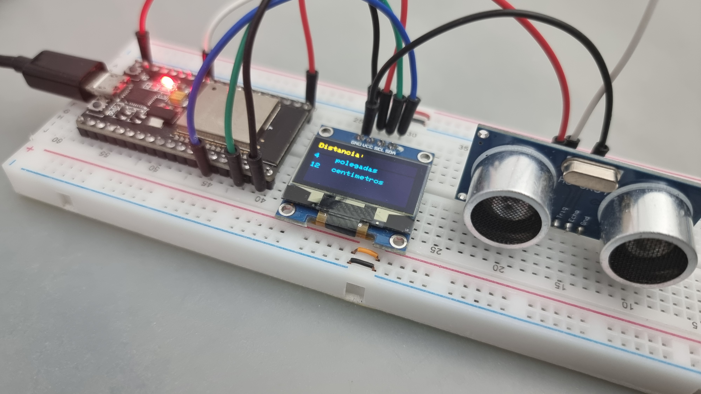

# Projeto: ESP32S e Sensor Ultrassônico HC-SR04

 

## Descrição
Neste projeto vamos utilizar um microcontrolador ESP32S e um Sensor Ultrassônico HC-SR04 para medir distâncias e exibir o resultado num display OLED SSD1306 de 128x64 0.96", com código criado na Arduino IDE.

## Introdução
O Sensor Ultrassônico HC-SR04 é um dispositivo de detecção de distância compacto e eficiente, capaz de medir com precisão objetos em um intervalo de 2 centímetros a 4 metros. Com sua interface simples de quatro pinos (VCC, Trigger, ECHO e GND), é facilmente integrado a uma variedade de sistemas microcontroladores. Possui alta taxa de atualização de leitura, permitindo respostas rápidas em tempo real. 

Além disso, seu baixo consumo de energia torna-o adequado para aplicações de longa duração alimentadas por bateria. Combinando precisão, eficiência e facilidade de uso, o HC SR04 é amplamente utilizado em projetos de automação, robótica, sistemas de segurança e muito mais.

## Como funciona o Sensor Ultrassônico HC-SR04

O Sensor Ultrassônico HC-SR04 funciona emitindo pulsos ultrassônicos quando o pino Trigger é colocado em nível alto por mais de 10us. Esses pulsos são refletidos por obstáculos e retornam ao módulo, fazendo o pino Echo permanecer em nível alto. A distância até o obstáculo pode ser calculada usando o tempo que o pino Echo permanece alto após o Trigger ser acionado. 

A fórmula de cálculo é: Distância = (Tempo ECHO em nível alto * Velocidade do Som) / 2 

A velocidade do som pode ser considerada idealmente igual a 340 m/s. Isso fornece a distância em metros devido à ida e volta do pulso ultrassônico.

#### Pinagem do Modulo HC-SR04

|Pino|Descrição|
| :---: | :---: |
|VCC|Conexão de alimentação. Deve ser conectado a alimentação do circuito ou pino 5V do microcontrolador.|
|GND|Este pino deve ser conectado ao terra (GND) do microcontrolador ou à fonte de alimentação.|
|TRIG|Pino de entrada do sinal de pulso de disparo.|
|ECHO|Pino de saída do sinal de eco, que indica a detecção do ultrassom.|

## Pré-requisitos
* Ter a [IDE](https://www.arduino.cc/en/software/) do Arduino instalada e configurada;
* Instalar a biblioteca Adafruit_SSD1306 e todas as suas dependencias;

## Material Necessário
* Microcontrolador ESP32 ou ESP32s;
* Display OLED SSD1306 128x64 0.96" I2C;
* Sensor Ultrassônico HC-SR04;
* Protoboard e jumpers;
* Cabo de dados para conexão do microcontrolador ao PC.

## Tabela de Conexões

|Pinos do ESP32S|Pinos do SSD1306|Pinos do HC-SR04|
| :---: | :---: | :---: |
|3.3 V (1)|VCC (2)|
|GND (38)|GND (1)|GND (4)|
|D22 (36)|SCL (3)| - |
|D21 (33)|SDA (4)| - |
|5v (19)| - |VCC (1)|
|GPIO14 (12)| - |TRIG (2) e ECHO(3)|

## Imagem das Conexões

## Foto do Projeto

